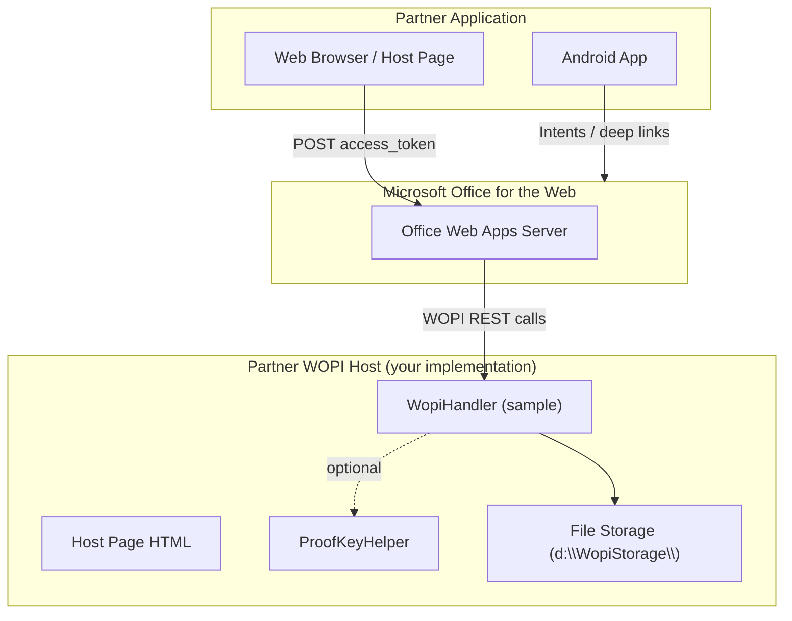
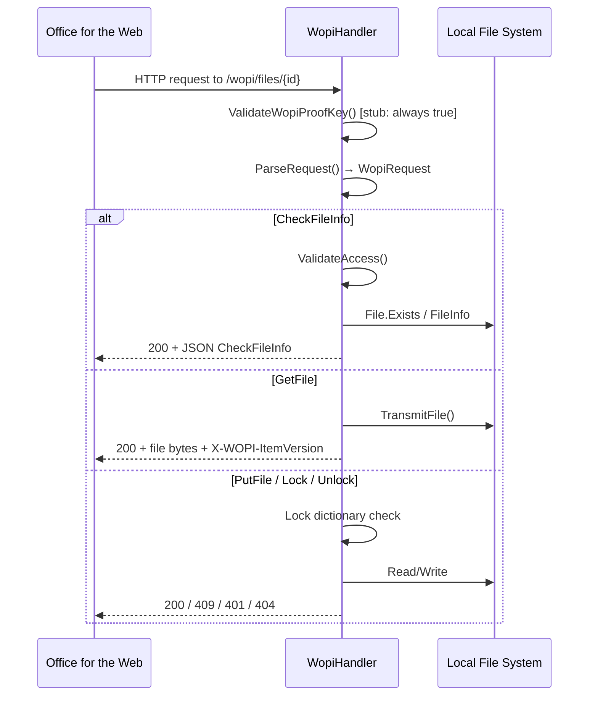
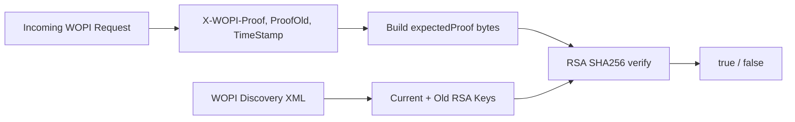

# Architecture Document

**Project:** Office for Web Test Tools and Documentation  
**Purpose:** Reference implementations and test utilities for integrating with Microsoft Office for the Web (WOPI / Cloud Storage Partner Program)  
**Official spec:** [Cloud Storage Partner Program documentation](https://docs.microsoft.com/en-us/microsoft-365/cloud-storage-partner-program/)

---

## 1. System Overview

This repository is **not a single deployable product**. It is a collection of **sample code, test harnesses, and integration templates** that partners use when building a WOPI host or embedding Office for the Web in web and mobile clients.

The repository is organized into four logical areas:

| Area | Location | Role |
|------|----------|------|
| WOPI Host (C#) | `samples/SampleWopiHandler/` | Illustrative ASP.NET HTTP handler implementing core WOPI file operations |
| Host Page (HTML) | `samples/SampleHostPage.html` | Template for embedding Office in an iframe via form POST |
| Proof Key Validation | `samples/python/`, `samples/java/`, `ProofKeyHelper.cs` | Cross-language reference for verifying WOPI request signatures |
| Android Integration | `samples/android/` | Deep-link, app-store, and app-to-app auth intent samples for China/mobile |



---

## 2. Component Architecture

### 2.1 Sample WOPI Handler (C# / ASP.NET)

The primary architectural artifact. Implements the **WOPI host** side of the Office integration.

```
samples/SampleWopiHandler/
├── SampleWopiHandler/
│   ├── WopiHandler.cs      # IHttpHandler — request routing and operation handlers
│   ├── WopiRequest.cs      # Request model, headers, RequestType enum
│   ├── WopiResponse.cs     # CheckFileInfo / PutRelativeFile DTOs
│   ├── ProofKeyHelper.cs   # RSA proof-key verification (standalone utility)
│   └── Web.config          # IIS handler registration at /wopi/*
└── SampleWopiHandler.UnitTests/
    └── ProofKeyTests.cs    # MSTest suite for proof keys
```

**Runtime:** ASP.NET 4.7.2, IIS / IIS Express  
**Entry point:** `WopiHandler.ProcessRequest()` — registered in `Web.config` for path `/wopi/*`

#### Request Processing Pipeline



#### Layering (conceptual)

| Layer | Classes | Responsibility |
|-------|---------|----------------|
| HTTP Adapter | `WopiHandler` (`IHttpHandler`) | Parse URL/method/headers, map to operation, write HTTP response |
| Domain Model | `WopiRequest`, `RequestType`, `WopiHeaders` | Normalize WOPI protocol into typed requests |
| Response DTOs | `CheckFileInfoResponse`, `PutRelativeFileResponse` | Serialize JSON bodies per [MS-WOPI] |
| Security (sample stubs) | `ValidateWopiProofKey`, `ValidateAccess`, `ProofKeysHelper` | Proof-key and token validation |
| Storage (sample) | `LocalStoragePath`, in-memory `Locks` | Files on disk; locks in `Dictionary<string, LockInfo>` |

#### Storage Design (Sample Only)

- **Files:** `d:\WopiStorage\{fileId}` — `fileId` is the WOPI resource ID from the URL path.
- **Locks:** In-process `static Dictionary<string, LockInfo>` with 30-minute TTL. Not persisted, not cluster-safe.

> Production hosts must replace both with durable, authorized storage and distributed locking.

---

### 2.2 Proof Key Validation (Multi-Language)

Proof keys let a WOPI host verify that incoming requests were signed by Microsoft's Office servers. Keys are obtained from **WOPI Discovery**.

| Language | Module | Test Coverage |
|----------|--------|---------------|
| C# | `ProofKeyHelper.cs` | `ProofKeyTests.cs` (8 cases) |
| Python | `proof_keys/__init__.py` | `tests.py` (8 cases) |
| Java | `ProofKeyTester.java` | Manual `main()` scenarios |

#### Proof Construction Algorithm (shared across languages)

All implementations build an `expectedProof` byte array:

1. 4 bytes — length of `access_token` (big-endian `uint32`)
2. `access_token` bytes (UTF-8)
3. 4 bytes — length of full request URL in **UPPERCASE** (big-endian `uint32`)
4. URL bytes (UTF-8, uppercase)
5. 4 bytes — length of timestamp (always 8 for `uint64`)
6. `X-WOPI-TimeStamp` as 8-byte big-endian `uint64`

Verification tries **three combinations**:

- `X-WOPI-Proof` + current discovery key
- `X-WOPI-ProofOld` + current discovery key
- `X-WOPI-Proof` + old discovery key

Signature algorithm: **RSA PKCS#1 v1.5 over SHA-256**.



> **Note:** `WopiHandler.ValidateWopiProofKey()` is a stub returning `true`. Use `ProofKeysHelper` for real validation.

---

### 2.3 Host Page (HTML Embedding)

`SampleHostPage.html` is a **static template** — no server logic.

**Pattern:** Hidden form POST → iframe target

| Placeholder | Meaning |
|-------------|---------|
| `<OFFICE_ACTION_URL>` | Office for the Web action URL (from discovery) |
| `<ACCESS_TOKEN_VALUE>` | WOPI access token for the session |
| `<ACCESS_TOKEN_TTL_VALUE>` | Token lifetime |
| `<OFFICE APPLICATION FAVICON URL>` | App-specific favicon |

The iframe uses a restrictive `sandbox` attribute to allow Office sign-in redirects in business flows while limiting script capabilities.

---

### 2.4 Android Samples

Fragmentary reference code for **China market app-store routing** and **app-to-app OAuth-style sign-in** with Office mobile apps.

| File | Purpose |
|------|---------|
| `MainActivity.java` | Demo UI; launches store chooser for Office app install |
| `AppStoreIntentHelper.java` | Builds intents for Play Store, Samsung, Baidu, Xiaomi, etc. |
| `App2AppSigninIntent.java` | Snippet: `startActivityForResult` auth flow with Office app |
| `HandleIntent.java` | Snippet: receiving side returning `ResponseUrlQueryParams` |
| `AndroidManifest.xml` | Minimal manifest stub |

These are **not a complete Android project** — they are copy-paste patterns.

---

## 3. WOPI URL Routing (Handler)

The handler expects URLs under `/wopi/`:

| Pattern | Method | Override Header | Operation |
|---------|--------|-----------------|-----------|
| `/wopi/files/{id}` | GET | — | CheckFileInfo |
| `/wopi/files/{id}` | POST | `X-WOPI-Override` | Lock, Unlock, RefreshLock, etc. |
| `/wopi/files/{id}/contents` | GET | — | GetFile |
| `/wopi/files/{id}/contents` | POST | — | PutFile |
| `/wopi/folders/{id}` | GET | — | CheckFolderInfo |
| `/wopi/folders/{id}/children` | GET | — | EnumerateChildren |

Query string: `?access_token={token}` on all requests.

---

## 4. HTTP Status Contract

| Code | When | WOPI Headers |
|------|------|--------------|
| 200 | Success | `X-WOPI-ItemVersion` on file ops |
| 401 | Missing/invalid token (`INVALID` fails validation) | — |
| 404 | File not found / unauthorized access | — |
| 409 | Lock mismatch | `X-WOPI-Lock`, optional `X-WOPI-LockFailureReason` |
| 500 | Parse/unknown errors; proof key failure (if enforced) | — |
| 501 | Unsupported operation | — |

---

## 5. Dependencies

### SampleWopiHandler

| Package | Version | Use |
|---------|---------|-----|
| Newtonsoft.Json | (packages.config) | `CheckFileInfo` JSON serialization |
| .NET Framework | 4.7.2 | Runtime |
| IIS | — | HTTP handler host |

### Python proof keys

| Package | Use |
|---------|-----|
| PyCrypto (`Crypto.*`) | RSA, SHA256, PKCS1_v1_5 |

### Java proof keys

JDK built-ins: `java.security.*`, `javax.xml.bind.DatatypeConverter`

---

## 6. Deployment Topology (Sample)

```
┌─────────────────────────────────────────┐
│  IIS / IIS Express                      │
│  ┌───────────────────────────────────┐  │
│  │  Web.config                       │  │
│  │  handler: /wopi/* → WopiHandler   │  │
│  └───────────────────────────────────┘  │
│              │                          │
│              ▼                          │
│  ┌───────────────────────────────────┐  │
│  │  d:\WopiStorage\                  │  │
│  │    {fileId}.docx                  │  │
│  │    {fileId}.xlsx                  │  │
│  └───────────────────────────────────┘  │
└─────────────────────────────────────────┘
         ▲
         │ HTTPS (WOPI from Office servers)
         │
┌────────┴────────┐
│ Office for Web  │
└─────────────────┘
```

**Configuration steps for local dev:**

1. Open `SampleWopiHandler.sln` in Visual Studio.
2. Ensure `d:\WopiStorage\` exists and contains test files.
3. File IDs in WOPI URLs must match filenames under that path.
4. Register handler is already in `Web.config`.

---

## 7. Security Architecture (Intended vs. Sample)

| Concern | Sample Behavior | Production Requirement |
|---------|-----------------|------------------------|
| Access tokens | Non-empty, not `"INVALID"` | Signed, time-limited, scoped tokens tied to user + file |
| Proof keys | Stub (`return true`) | Validate via `ProofKeysHelper`; reject stale timestamps (>20 min) |
| File authorization | Existence check only | Per-user ACLs, tenant isolation |
| Locks | In-memory, 30 min TTL | Distributed lock store (Redis, DB, blob leases) |
| Path traversal | `fileId` used directly in `Path.Combine` | Sanitize IDs; never expose raw filesystem paths |

---

## 8. Extension Points

When building a real WOPI host from these samples:

1. **Replace `ValidateAccess`** — integrate with your identity provider and document permissions.
2. **Wire `ProofKeysHelper.Validate`** into `ValidateWopiProofKey` — fetch keys from discovery on a schedule.
3. **Swap `LocalStoragePath`** — S3, Azure Blob, SharePoint, database BLOB column, etc.
4. **Implement `PutRelativeFile`** — required for Save As / co-authoring flows; set `UserCanNotWriteRelative = false` in CheckFileInfo.
5. **Add folder operations** — if your product exposes folder browsing in Office.
6. **Host page** — generate tokens server-side; never hard-code secrets in HTML.

---

## 9. Testing Strategy

| Asset | How to run | What it validates |
|-------|------------|-------------------|
| `ProofKeyTests.cs` | Visual Studio Test Explorer / MSTest | All 8 official proof-key vectors |
| `tests.py` | `python -m unittest samples/python/proof_keys/tests.py` | Same vectors in Python |
| `ProofKeyTester.java` | Compile & run `main` | Subset of vectors; prints `VERIFIED = true/false` |
| WOPI Validator (external) | Microsoft-hosted tool | End-to-end host compliance — not in this repo |

---

## 10. Repository Map

```
Office-Online-Test-Tools-and-Documentation/
├── docs/
│   ├── ARCHITECTURE.md          ← this document
│   └── FUNCTIONAL.md            ← feature / behavior reference
├── samples/
│   ├── SampleWopiHandler/       ← C# WOPI host sample + unit tests
│   ├── SampleHostPage.html      ← Office iframe embed template
│   ├── python/proof_keys/       ← Python proof-key library + tests
│   ├── java/ProofKeyTester.java ← Java proof-key tester
│   └── android/                 ← Mobile integration snippets
├── README.md
├── LICENSE
└── SECURITY.md
```

---

## 11. Key Design Decisions (Rationale)

1. **Single `IHttpHandler` vs. Web API controllers** — Keeps the sample deployable as one IIS handler with minimal ceremony; partners can refactor to ASP.NET Core minimal APIs or controllers.

2. **Filesystem storage** — Lowest friction for local WOPI Validator testing; deliberately not cloud-coupled.

3. **In-memory locks** — Demonstrates lock mismatch semantics without introducing Redis/SQL dependencies.

4. **Proof keys as separate modules** — Validation is complex and language-specific; isolating it lets partners port to their stack without copying the full handler.

5. **Android as fragments** — Mobile integration varies by OEM store; snippets avoid maintaining a full Gradle project.

---

## 12. References

- [MS-WOPI Protocol](https://learn.microsoft.com/en-us/microsoft-365/cloud-storage-partner-program/online/)
- [WOPI REST documentation](https://wopi.readthedocs.io/)
- [Proof keys scenario](https://wopi.readthedocs.io/en/latest/scenarios/proofkeys.html)
- [WOPI Discovery](https://wopi.readthedocs.io/en/latest/discovery.html)
