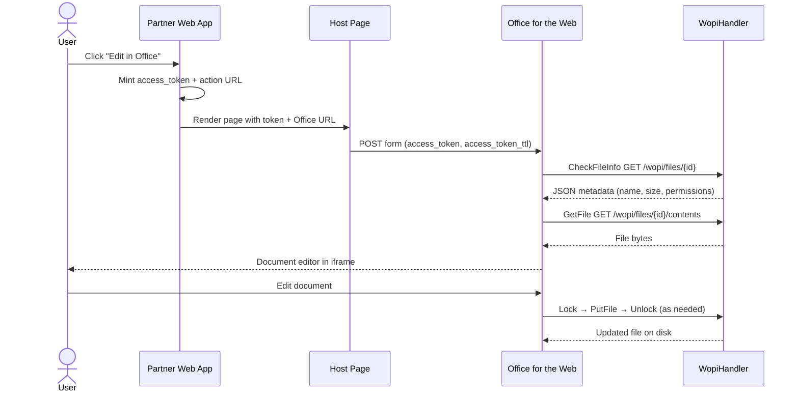

# Functional Document

**Project:** Office for Web Test Tools and Documentation  
**Audience:** Engineers integrating Office for the Web as a WOPI host or embedding Office in web/mobile clients  
**Companion:** [ARCHITECTURE.md](./ARCHITECTURE.md)

---

## 1. Purpose and Scope

This repository provides **working reference code** for the [Microsoft Cloud Storage Partner Program](https://docs.microsoft.com/en-us/microsoft-365/cloud-storage-partner-program/) (Office for the Web / WOPI integration).

### What this repo does

- Demonstrates how a WOPI host handles file read/write, metadata, and locking.
- Provides copy-paste proof-key validation in C#, Python, and Java.
- Supplies an HTML host page template for iframe embedding.
- Includes Android patterns for app-store deep links and app-to-app authentication.

### What this repo does not do

- Host Office for the Web itself (that runs on Microsoft's infrastructure or your licensed deployment).
- Provide production-ready authentication, multi-tenancy, or durable storage.
- Ship a complete mobile application.

---

## 2. User Roles and Actors

| Actor | Description | Interacts With |
|-------|-------------|----------------|
| **End user** | Opens a document in Word/Excel/PowerPoint in the browser | Host page → Office iframe |
| **Partner developer** | Builds the WOPI host and token issuance | SampleWopiHandler, proof-key samples |
| **Office for the Web** | Microsoft's document rendering/editing service | Calls WOPI REST endpoints on the partner host |
| **WOPI Validator** | Microsoft's compliance testing tool | Sends scripted WOPI requests including `access_token=INVALID` |
| **Android app developer** | Embeds Office mobile or routes users to install Office | Android samples |

---

## 3. End-to-End User Flows

### 3.1 Open Document for Editing (Web)



**Functional steps:**

1. Partner application authenticates the user.
2. Partner generates a WOPI **access token** and **Office action URL** (from WOPI Discovery).
3. Host page POSTs the token into an Office iframe.
4. Office calls the partner's WOPI host to fetch metadata and file content.
5. On save, Office acquires a lock, uploads content via PutFile, then releases the lock.

---

### 3.2 Proof Key Verification (Security)

When enabled, every WOPI request from Office includes:

| Header | Description |
|--------|-------------|
| `X-WOPI-Proof` | RSA signature with current key |
| `X-WOPI-ProofOld` | RSA signature with previous key (during key rotation) |
| `X-WOPI-TimeStamp` | 64-bit timestamp used in signature |

**Functional behavior of `ProofKeysHelper.Validate()`:**

1. Accept access token, full URL (with query string), timestamp, proof, and old proof.
2. Build the canonical proof byte array per [MS-WOPI].
3. Attempt verification against current and old discovery keys.
4. Return `true` if any valid combination matches.

**Production addition (not in test vectors):** Reject requests where `X-WOPI-TimeStamp` is older than 20 minutes.

**Test cases included:** 6 valid scenarios + 2 invalid — see `ProofKeyTests.cs` / `tests.py`.

---

### 3.3 Android: Install Office from Regional App Store

**Entry:** `MainActivity` button → `AppStoreIntentHelper`

**Functional behavior:**

1. Maintain an allowlist of known China/regional app store package names (Play, Samsung, Baidu, Xiaomi, Tencent, etc.).
2. Query the device for installed store apps matching the allowlist.
3. Build a **chooser intent** so the user picks their preferred store.
4. Each store intent uses the correct URI scheme:
   - Google Play: `https://play.google.com/store/apps/details?id=`
   - Samsung: `samsungapps://ProductDetail/`
   - Amazon: `amzn://apps/android?p=`
   - Others: `market://details?id=`
5. Append referrer/UTM query string (`REFERRERSTRING`) for attribution tracking.
6. If no store is available, fall back to a marketing web page (`FALL_BACK_PAGE_URI`).

**Configurable constants (must be customized):**

- `APP_PACKAGE_MAKETING_FOR` — target Office app package (e.g. `com.microsoft.office.excel`)
- `ADJUST_CHINA_STORE_LINK` — Adjust tracking URL
- `REFERRERSTRING` in `AppStoreIntentProvider`

---

### 3.4 Android: App-to-App Sign-In with Office

**Pattern:** Partner app ↔ Office mobile app via explicit `ComponentName` intent.

**Caller side (`App2AppSigninIntent.java` snippet):**

1. Build intent targeting Office app's auth activity.
2. Pass `AuthorizeUrlQueryParams` extra with OAuth-like parameters: `client_id`, `response_type=code`, `scope=wopi`, `platform=android`, `app=word`, etc.
3. Pass `UserId` extra.
4. `startActivityForResult` with a unique request code.

**Callee side (`HandleIntent.java` snippet):**

1. Read extras from incoming intent.
2. Perform authentication.
3. Return `RESULT_OK` with `ResponseUrlQueryParams` extra containing `code`, `tk` (token endpoint), `sc` (session context).

**Result handling:**

| `resultCode` | Meaning | Response extras |
|--------------|---------|-----------------|
| `RESULT_OK` | Auth succeeded | `code`, `tk`, `sc` |
| `RESULT_CANCELED` | User cancelled | May include `error`, `error_description` |
| Other | Failure | Error parameters |

---

## 4. WOPI Operations — Functional Specification

### 4.1 Implemented Operations

#### CheckFileInfo

- **Trigger:** `GET /wopi/files/{id}?access_token=...`
- **Auth:** Read access (token must be non-empty and not `INVALID`)
- **Success response:** HTTP 200, JSON body

| Field | Sample Value | Meaning |
|-------|--------------|---------|
| `BaseFileName` | Filename from disk | Display name in Office UI |
| `OwnerId` | `"documentOwnerId"` | Document owner identifier |
| `Size` | File length in bytes | Required |
| `UserId` | `"user@contoso.com"` | Current WOPI user |
| `Version` | ISO 8601 last-write UTC | Change detection |
| `SupportsLocks` | `true` | Host supports locking |
| `SupportsUpdate` | `true` | Host supports PutFile |
| `UserCanNotWriteRelative` | `true` | PutRelativeFile not implemented |
| `ReadOnly` / `UserCanWrite` | From `FileInfo.IsReadOnly` | Edit permissions |
| Breadcrumb fields | Host name, folder name | Navigation UI in Office |

- **Errors:** 401 (bad token), 404 (file missing)

---

#### GetFile

- **Trigger:** `GET /wopi/files/{id}/contents?access_token=...`
- **Auth:** Read access
- **Success:** HTTP 200, raw file stream, header `X-WOPI-ItemVersion`
- **Errors:** 401, 404

---

#### PutFile

- **Trigger:** `POST /wopi/files/{id}/contents?access_token=...`
- **Auth:** Write access
- **Headers:** `X-WOPI-Lock` (lock string from Office)
- **Preconditions:**
  - If file is locked, lock header must match stored lock.
  - If file is **not** locked, upload is allowed only when file size is **0 bytes** (create-new optimization).
  - Otherwise → 409 Lock Mismatch.
- **Success:** HTTP 200, `X-WOPI-ItemVersion` updated
- **Behavior:** Truncates file and writes request body stream
- **Errors:** 401, 404, 409, 500 (IO failure)

---

#### Lock

- **Trigger:** `POST /wopi/files/{id}` + `X-WOPI-Override: LOCK`
- **Auth:** Write access
- **Headers:** `X-WOPI-Lock`
- **Behavior:**
  - No existing lock (or expired) → store new lock, return 200 + `X-WOPI-ItemVersion`
  - Existing lock matches → refresh (remove + re-add), return 200
  - Existing lock differs → 409 with `X-WOPI-Lock` set to current lock
- **Lock TTL:** 30 minutes from `DateCreated`

---

#### Unlock

- **Trigger:** `POST /wopi/files/{id}` + `X-WOPI-Override: UNLOCK`
- **Headers:** `X-WOPI-Lock` must match stored lock
- **Success:** Remove lock, 200 + `X-WOPI-ItemVersion`
- **Failure:** 409 if lock missing or mismatched

---

#### RefreshLock

- **Trigger:** `POST /wopi/files/{id}` + `X-WOPI-Override: REFRESH_LOCK`
- **Headers:** `X-WOPI-Lock` must match
- **Success:** Reset `DateCreated` to now (extends 30-min window), 200
- **Failure:** 409

---

#### UnlockAndRelock

- **Trigger:** `POST /wopi/files/{id}` + `X-WOPI-Override: LOCK` + `X-WOPI-OldLock` header present
- **Headers:** `X-WOPI-OldLock` must match current; `X-WOPI-Lock` is new lock
- **Success:** Replace lock, set response `X-WOPI-OldLock` to new lock, 200
- **Failure:** 409

---

### 4.2 Explicitly Unsupported Operations (HTTP 501)

| Operation | Override / Path | Notes |
|-----------|-----------------|-------|
| PutRelativeFile | `PUT_RELATIVE` | Save As / new file from template |
| EnumerateChildren | `GET /wopi/folders/{id}/children` | Folder listing |
| CheckFolderInfo | `GET /wopi/folders/{id}` | Folder metadata |
| DeleteFile | `DELETE` | File deletion |
| ExecuteCobaltRequest | `COBALT` | Advanced Excel operations |
| ReadSecureStore | `READ_SECURE_STORE` | Secure settings |
| GetRestrictedLink | `GET_RESTRICTED_LINK` | Sharing links |
| RevokeRestrictedLink | `REVOKE_RESTRICTED_LINK` | Revoke sharing |

> **Partner note:** Most production hosts implement at least `PutRelativeFile`.

---

## 5. Access Token Validation (Sample)

**Function:** `ValidateAccess(requestData, writeAccessRequired)`

| Input | Rule |
|-------|------|
| `access_token` query param | Must be non-null, non-whitespace |
| Token value `"INVALID"` | Always rejected (401) — supports WOPI Validator negative tests |
| `writeAccessRequired` | Accepted in signature but **not enforced** in sample (read and write use same rule) |

**Production expectation:** Decode JWT or lookup opaque token in cache/DB; verify user, file ID, permission bitmask, and expiry.

---

## 6. Host Page — Functional Behavior

File: `samples/SampleHostPage.html`

| Element | Function |
|---------|----------|
| `#office_form` | POSTs `access_token` and `access_token_ttl` to Office |
| `#office_frame` | Full-viewport iframe receiving the Office session |
| `sandbox` attribute | Allows scripts, forms, popups, top navigation for M365 sign-in |
| `allowfullscreen` | Enables PowerPoint slideshow fullscreen |
| Auto-submit script | Submits form on page load to start session |

**Required replacements before use:**

- `<OFFICE_ACTION_URL>` — from WOPI discovery for the desired app/action (view, edit, embedview, etc.)
- `<ACCESS_TOKEN_VALUE>` / `<ACCESS_TOKEN_TTL_VALUE>` — from your token service
- `<OFFICE APPLICATION FAVICON URL>` — per application

---

## 7. Proof Key Test Matrix

All implementations share the same discovery keys and test vectors.

| Test ID | Scenario | Expected |
|---------|----------|----------|
| 1 | `X-WOPI-Proof` + current key | Pass |
| 2 | `X-WOPI-Proof` + current key (variant URL) | Pass |
| 3 | `X-WOPI-ProofOld` + current key | Pass |
| 4 | `X-WOPI-ProofOld` + current key (variant) | Pass |
| 5 | `X-WOPI-Proof` + old discovery key | Pass |
| 6 | `X-WOPI-Proof` + old discovery key (variant) | Pass |
| 7 | Tampered proof | Fail |
| 8 | Wrong key combination | Fail |

**How to run:**

```bash
# Python (from repo root; requires PyCrypto)
python -m unittest samples/python/proof_keys/tests.py

# C# — open solution in Visual Studio, run ProofKeyTests

# Java — compile and run ProofKeyTester.main()
```

---

## 8. Configuration Reference

### WOPI Handler

| Setting | Location | Default | Description |
|---------|----------|---------|-------------|
| `LocalStoragePath` | `WopiHandler.cs` | `d:\WopiStorage\` | Root directory for WOPI file IDs |
| Handler path | `Web.config` | `/wopi/*` | IIS route mapping |
| Lock timeout | `LockInfo.Expired` | 30 minutes | In-memory lock expiry |

### Android Samples

| Constant | File | Purpose |
|----------|------|---------|
| `APP_PACKAGE_MAKETING_FOR` | `MainActivity.java` | Office app package to open/install |
| `FALL_BACK_PAGE_URI` | `MainActivity.java` | Web fallback when no store found |
| `ADJUST_CHINA_STORE_LINK` | `MainActivity.java` | Attribution deep link |
| `REFERRERSTRING` | `AppStoreIntentProvider` | Appended to store URIs |

---

## 9. Error Scenarios and Expected Behavior

| Scenario | Operation | HTTP | Headers / Body |
|----------|-----------|------|----------------|
| Missing token | Any | 401 | — |
| Token = `INVALID` | Any | 401 | WOPI Validator case |
| Unknown file ID | Any | 404 | — |
| PutFile on locked file, wrong lock | PutFile | 409 | `X-WOPI-Lock: {existing}` |
| PutFile on non-zero unlocked file | PutFile | 409 | `X-WOPI-LockFailureReason` |
| Lock held by another session | Lock | 409 | `X-WOPI-Lock: {existing}` |
| Unlock with wrong lock | Unlock | 409 | — |
| Unlock file not locked | Unlock | 409 | `LockFailureReason: File not locked` |
| Unsupported WOPI call | Various | 501 | — |
| Unparseable request | — | 500 | — |
| Proof key fails (when implemented) | Any | 500 | Before operation handler runs |

---

## 10. Functional Requirements for Production Migration

Use this checklist when moving from sample to production:

### Must have

- [ ] Real access token issuance and validation (expiry, file scope, read/write claims)
- [ ] Proof key validation on every WOPI request
- [ ] Timestamp freshness check (≤ 20 minutes)
- [ ] Authorized storage backend with audit logging
- [ ] Distributed, durable lock management
- [ ] HTTPS everywhere (WOPI requires TLS)
- [ ] File ID → storage key indirection (prevent path traversal)

### Should have

- [ ] `PutRelativeFile` for Save As
- [ ] User identity mapping (`UserId`, `OwnerId`, `UserFriendlyName`) from your directory
- [ ] Correct `Version` / `X-WOPI-ItemVersion` strategy (ETag, content hash, or monotonic version)
- [ ] Rate limiting and request size limits on PutFile

### Nice to have

- [ ] Folder operations (EnumerateChildren, CheckFolderInfo)
- [ ] Cobalt support for advanced Excel features
- [ ] Restricted link / sharing integration

---

## 11. Glossary

| Term | Definition |
|------|------------|
| **WOPI** | Web Application Open Platform Interface — REST protocol between Office and a file host |
| **WOPI Host** | Partner service storing files and implementing WOPI operations |
| **Office for the Web** | Browser-based Word, Excel, PowerPoint, etc. |
| **Access token** | Opaque or signed string authorizing Office to call WOPI on behalf of a user |
| **Proof key** | RSA public key from WOPI Discovery used to verify Office-signed requests |
| **File ID** | URL-safe identifier for a document in WOPI paths |
| **Lock** | WOPI cooperative lock string preventing concurrent writes |
| **CheckFileInfo** | WOPI metadata endpoint — Office calls this before rendering a document |
| **Discovery** | XML endpoint listing Office URLs, actions, and proof keys |

---

## 12. Related Documentation

- [ARCHITECTURE.md](./ARCHITECTURE.md) — component design, deployment, security model
- [Official CSPP docs](https://docs.microsoft.com/en-us/microsoft-365/cloud-storage-partner-program/)
- [WOPI REST reference](https://wopi.readthedocs.io/projects/wopirest/en/latest/)
- [CheckFileInfo spec](https://wopi.readthedocs.io/projects/wopirest/en/latest/files/CheckFileInfo.html)
- [SECURITY.md](../SECURITY.md) — vulnerability reporting
