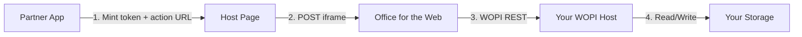

# WOPI / Office for the Web — Implementation Guide

**Purpose:** Step-by-step checklist to go from zero to a production-ready Office for the Web integration.  
**Companion docs:** [ARCHITECTURE.md](./ARCHITECTURE.md) · [FUNCTIONAL.md](./FUNCTIONAL.md)  
**Official reference:** [Cloud Storage Partner Program (CSPP)](https://learn.microsoft.com/en-us/microsoft-365/cloud-storage-partner-program/)

---

## Overview

A successful integration has **four moving parts**:



| # | Component | You build | Microsoft provides |
|---|-----------|-----------|-------------------|
| 1 | **WOPI host** | REST API at `/wopi/files/{id}` | — |
| 2 | **Access token service** | Issue scoped, time-limited tokens | — |
| 3 | **Host page** | HTML that POSTs token into Office iframe | Action URLs via Discovery |
| 4 | **Office for the Web** | — | Rendering, editing, WOPI client calls |

Use the samples in this repo as starting points:

| Stack | Sample path |
|-------|-------------|
| C# / IIS | `samples/SampleWopiHandler/` |
| Node / Express | `samples/SampleWopiHandler-Node/` |
| Proof keys (Python) | `samples/python/proof_keys/` |
| Proof keys (Java) | `samples/java/ProofKeyTester.java` |
| Host page template | `samples/SampleHostPage.html` |
| Android (optional) | `samples/android/` |

---

## Phase 0 — Prerequisites

### Step 0.1: Join the partner program

- [ ] Enroll in the [Microsoft Cloud Storage Partner Program](https://learn.microsoft.com/en-us/microsoft-365/cloud-storage-partner-program/)
- [ ] Obtain access to **Office for the Web** (Microsoft-hosted or licensed on-premises deployment)
- [ ] Receive your **WOPI domain** / integration configuration from Microsoft
- [ ] Confirm which apps you need: Word, Excel, PowerPoint, OneNote, etc.

### Step 0.2: Infrastructure requirements

- [ ] **HTTPS everywhere** — WOPI requires TLS; Office servers call your host over the public internet
- [ ] Publicly reachable WOPI endpoint (or VPN/tunnel for dev)
- [ ] Document storage backend (filesystem for dev; S3/Blob/DB for prod)
- [ ] Identity provider integrated with your app (OAuth, SAML, custom session, etc.)

### Step 0.3: Read the protocol

- [ ] Skim [MS-WOPI specification](https://learn.microsoft.com/en-us/microsoft-365/cloud-storage-partner-program/online/)
- [ ] Bookmark [WOPI REST reference](https://wopi.readthedocs.io/projects/wopirest/en/latest/)
- [ ] Understand the terms: **file id**, **access token**, **proof key**, **lock**, **CheckFileInfo**

---

## Phase 1 — WOPI Discovery

Discovery is an XML document published by Office that lists action URLs, favicons, and **proof keys**.

### Step 1.1: Fetch and cache discovery

- [ ] Fetch discovery XML from your Office deployment (URL provided by Microsoft)
- [ ] Parse and cache:
  - Action URLs (`view`, `edit`, `embedview`, etc.) per file extension
  - `proof-key` values: `value`, `modulus`, `exponent`, `oldvalue`, `oldmodulus`, `oldexponent`
- [ ] Refresh discovery on a schedule (keys rotate; keep current + old key)

### Step 1.2: Build Office action URLs

When a user opens a file, select the correct action from discovery:

```
{discovery-action-url}?WOPISrc={url-encoded-wopi-file-url}&access_token={token}
```

- [ ] Map file extensions to apps (`.docx` → Word, `.xlsx` → Excel, …)
- [ ] Choose action: `edit` vs `view` vs `embedview` based on user permission
- [ ] Construct `WOPISrc` as your WOPI file endpoint:
  ```
  https://your-host.com/wopi/files/{fileId}
  ```

**Example:**

```
https://word.officeapps.live.com/we/wordeditorframe.aspx?
  WOPISrc=https%3A%2F%2Fpartner.com%2Fwopi%2Ffiles%2Fabc123
  &access_token=eyJhbG...
```

---

## Phase 2 — Access Token Service

The access token authorizes Office to call your WOPI host on behalf of a user. It is passed as `?access_token=` on every WOPI request.

### Step 2.1: Design token claims

At minimum, encode (or map via lookup):

| Claim | Purpose |
|-------|---------|
| User identity | Maps to `UserId` / `UserFriendlyName` in CheckFileInfo |
| File id | Which document this session may access |
| Permissions | Read-only vs read-write |
| Expiry | Token TTL (Office also receives `access_token_ttl` on the host page) |
| Tenant / org | Multi-tenant isolation |

### Step 2.2: Implement token issuance

- [ ] Create an endpoint in **your app** (not WOPI) that mints tokens after user auth
- [ ] Use signed JWT **or** opaque token stored in Redis/DB with metadata
- [ ] Set TTL (typically minutes to hours; must match `access_token_ttl` sent to Office)
- [ ] Never expose token minting to unauthenticated users

### Step 2.3: Implement token validation in WOPI host

Replace the sample stub (`ValidateAccess`) with real logic:

- [ ] Reject missing, expired, or malformed tokens → **401**
- [ ] Reject token value `INVALID` → **401** (required for WOPI Validator)
- [ ] Verify token is scoped to the `fileId` in the request path
- [ ] Enforce read vs write permission per operation (PutFile/Lock require write)
- [ ] Log failed validation attempts

**Sample stub to replace (Node):**

```javascript
// src/wopiHandler.js — replace validateAccess()
function validateAccess(requestData, writeAccessRequired) {
  const claims = verifyAndDecodeToken(requestData.accessToken);
  if (!claims) return false;
  if (claims.fileId !== requestData.id) return false;
  if (writeAccessRequired && !claims.canWrite) return false;
  return true;
}
```

---

## Phase 3 — WOPI Host Endpoints

Implement a REST handler at `/wopi/files/{id}` (and optionally `/wopi/folders/{id}`).

Start from `samples/SampleWopiHandler-Node/` or `samples/SampleWopiHandler/` and replace storage/auth stubs.

### Step 3.1: Request routing

Parse incoming requests into operation types:

| HTTP | Path | Header | Operation |
|------|------|--------|-----------|
| GET | `/wopi/files/{id}` | — | CheckFileInfo |
| GET | `/wopi/files/{id}/contents` | — | GetFile |
| POST | `/wopi/files/{id}/contents` | — | PutFile |
| POST | `/wopi/files/{id}` | `X-WOPI-Override: LOCK` | Lock |
| POST | `/wopi/files/{id}` | `X-WOPI-Override: UNLOCK` | Unlock |
| POST | `/wopi/files/{id}` | `X-WOPI-Override: REFRESH_LOCK` | RefreshLock |
| POST | `/wopi/files/{id}` | `X-WOPI-Override: LOCK` + `X-WOPI-OldLock` | UnlockAndRelock |

- [ ] Route all `/wopi/*` traffic to a single handler (see `Web.config` or `server.js`)
- [ ] Extract `access_token` from query string on every request
- [ ] Map `fileId` from URL to internal storage key (see Step 3.7)

### Step 3.2: CheckFileInfo (required)

`GET /wopi/files/{id}?access_token=...` → JSON metadata

- [ ] Return **200** with required fields: `BaseFileName`, `OwnerId`, `Size`, `UserId`, `Version`
- [ ] Set capability flags:
  - `SupportsLocks: true` if you implement locking
  - `SupportsUpdate: true` if you implement PutFile
  - `UserCanWrite` / `ReadOnly` from user permissions
  - `UserCanNotWriteRelative: true` until PutRelativeFile is implemented
- [ ] Populate breadcrumb fields for navigation UI (optional but recommended)
- [ ] Use a consistent `Version` strategy (file write time, ETag, content hash, monotonic counter)
- [ ] Return **404** if file not found or user unauthorized
- [ ] Return **401** for invalid token

### Step 3.3: GetFile (required)

`GET /wopi/files/{id}/contents?access_token=...` → raw file bytes

- [ ] Stream file content in response body
- [ ] Set `X-WOPI-ItemVersion` header (same scheme as `Version` in CheckFileInfo)
- [ ] Return **404** / **401** as appropriate
- [ ] Support range requests if you expect large files (optional, improves performance)

### Step 3.4: PutFile (required for editing)

`POST /wopi/files/{id}/contents?access_token=...` → write file

- [ ] Require `X-WOPI-Lock` header matching active lock (if file is locked)
- [ ] Allow lock-free PutFile only when file size is **0 bytes** (create-new optimization)
- [ ] Return **409** with `X-WOPI-Lock` on lock mismatch
- [ ] Return updated `X-WOPI-ItemVersion` on success
- [ ] Write atomically (temp file + rename, or transactional blob upload)
- [ ] Enforce max upload size

### Step 3.5: Lock operations (required for editing)

Office uses locks to prevent concurrent write conflicts.

- [ ] **Lock** — store lock string keyed by `fileId`; return **409** if different lock exists
- [ ] **Unlock** — remove lock if `X-WOPI-Lock` matches; else **409**
- [ ] **RefreshLock** — extend lock TTL if lock matches
- [ ] **UnlockAndRelock** — atomic lock swap when `X-WOPI-OldLock` matches
- [ ] Use **durable, distributed** lock storage in production (Redis, SQL, blob leases)
- [ ] Set lock TTL (sample uses 30 minutes; Office refreshes periodically)
- [ ] Include `X-WOPI-Lock` response header on **409** responses

### Step 3.6: PutRelativeFile (recommended)

Required for **Save As** and some create flows.

- [ ] `POST /wopi/files/{id}` with `X-WOPI-Override: PUT_RELATIVE`
- [ ] Read `X-WOPI-SuggestedTarget`, `X-WOPI-RelativeTarget`, `X-WOPI-OverwriteRelativeTarget` headers
- [ ] Create new file relative to source; return JSON: `Name`, `Url`, `HostViewUrl`, `HostEditUrl`
- [ ] Set `UserCanNotWriteRelative: false` in CheckFileInfo once implemented

### Step 3.7: File ID and storage mapping

- [ ] Use opaque IDs in URLs (UUID, encoded path) — never raw filesystem paths
- [ ] Sanitize `fileId` to prevent path traversal (`../` attacks)
- [ ] Map `fileId` → storage location in your backend
- [ ] Replace sample `LocalStoragePath` / `d:\WopiStorage\` with your storage SDK

### Step 3.8: Unsupported operations (return 501)

Until implemented, return **501 Unsupported** for:

- [ ] `EnumerateChildren` / `CheckFolderInfo` (folder browsing)
- [ ] `DeleteFile`
- [ ] `ExecuteCobaltRequest` (advanced Excel)
- [ ] `ReadSecureStore`, `GetRestrictedLink`, `RevokeRestrictedLink`

---

## Phase 4 — Proof Key Validation

Proof keys cryptographically verify that WOPI requests originate from Microsoft's Office servers.

### Step 4.1: Understand the headers

Every WOPI request from Office includes:

| Header | Description |
|--------|-------------|
| `X-WOPI-Proof` | RSA-SHA256 signature with current key |
| `X-WOPI-ProofOld` | Signature with previous key (during rotation) |
| `X-WOPI-TimeStamp` | 64-bit integer timestamp |

### Step 4.2: Implement validation

Port `ProofKeyHelper` from this repo (C#, Node, Python, or Java):

1. Build `expectedProof` byte array:
   - 4-byte BE uint32 + access_token bytes (UTF-8)
   - 4-byte BE uint32 + full URL bytes (UTF-8, **uppercase**, including query string)
   - 4-byte BE uint32 + timestamp bytes (8-byte BE uint64)
2. Verify signature against discovery **current** and **old** keys (three combinations)
3. Reject if `X-WOPI-TimeStamp` is older than **20 minutes**

- [ ] Wire validation into every WOPI request (replace `ValidateWopiProofKey` stub)
- [ ] Return **500** on proof failure (or 401 per your security policy)
- [ ] Cache discovery keys; refresh before old key expires
- [ ] Log proof failures for monitoring

**Node reference:** `samples/SampleWopiHandler-Node/src/proofKeyHelper.js`

### Step 4.3: Test proof keys

- [ ] Run proof-key unit tests in your language
- [ ] Test with current key, old key, and `X-WOPI-ProofOld` header scenarios

---

## Phase 5 — Host Page (Iframe Embedding)

### Step 5.1: Build the host page

Start from `samples/SampleHostPage.html`.

- [ ] Server-render the page with user-specific values (never static secrets)
- [ ] Replace placeholders:
  - `<OFFICE_ACTION_URL>` — from discovery + WOPISrc + token
  - `<ACCESS_TOKEN_VALUE>` — from your token service
  - `<ACCESS_TOKEN_TTL_VALUE>` — TTL in milliseconds
  - `<OFFICE APPLICATION FAVICON URL>` — from discovery

### Step 5.2: Iframe configuration

- [ ] Full-viewport iframe (`#office_frame`)
- [ ] `sandbox` attribute: `allow-scripts allow-same-origin allow-forms allow-popups allow-top-navigation allow-popups-to-escape-sandbox`
- [ ] `allowfullscreen` for PowerPoint slideshow
- [ ] Auto-submit hidden form on page load to start Office session
- [ ] Set iframe `title` for accessibility

### Step 5.3: Security headers

- [ ] Serve host page over HTTPS
- [ ] Set `Content-Security-Policy` appropriate for Office iframe domain
- [ ] Prevent token leakage in logs, referrer headers, or browser history where possible

---

## Phase 6 — Error Handling and HTTP Contract

Implement consistent status codes across all endpoints:

| Code | When |
|------|------|
| **200** | Success |
| **401** | Invalid / missing / expired access token |
| **404** | File not found or user not authorized to know it exists |
| **409** | Lock mismatch (include `X-WOPI-Lock`, optional `X-WOPI-LockFailureReason`) |
| **500** | Server error; proof key failure |
| **501** | Operation not implemented |

- [ ] Return correct headers on every response (`X-WOPI-ItemVersion` where required)
- [ ] Do not leak internal paths or stack traces in response bodies
- [ ] Add structured logging with request id, file id, operation type, status

---

## Phase 7 — Testing

### Step 7.1: Local smoke tests

- [ ] Place a test file in storage; hit CheckFileInfo and GetFile with curl
- [ ] Run sample unit tests:
  ```bash
  # Node
  cd samples/SampleWopiHandler-Node && npm test

  # Python proof keys
  python -m unittest samples/python/proof_keys/tests.py
  ```

### Step 7.2: Manual lock/edit flow

- [ ] Lock → PutFile → Unlock sequence via curl or Postman
- [ ] Verify **409** on lock mismatch (wrong lock string)
- [ ] Verify **409** on PutFile to unlocked non-empty file
- [ ] Verify **401** with `access_token=INVALID`

### Step 7.3: WOPI Validator (required for partner certification)

Microsoft provides the **WOPI Validator** tool that sends scripted requests to your host.

- [ ] Deploy WOPI host to a publicly accessible HTTPS URL
- [ ] Run WOPI Validator against your endpoint
- [ ] Fix all failing checks (common failures: locks, CheckFileInfo fields, token validation, proof keys)
- [ ] Re-run until clean pass

### Step 7.4: End-to-end with Office

- [ ] Open host page in browser with a real token
- [ ] Confirm document loads in iframe
- [ ] Edit and save; verify file updated in storage
- [ ] Test read-only user (view action, `UserCanWrite: false`)
- [ ] Test concurrent edit (second session should get lock conflict)

---

## Phase 8 — Production Hardening

### Step 8.1: Security

- [ ] Enable proof key validation on every request
- [ ] Enforce timestamp freshness (≤ 20 minutes)
- [ ] Real token issuance with short TTL
- [ ] Per-user file authorization (ACL checks on every operation)
- [ ] Rate limiting on WOPI endpoints
- [ ] Input size limits on PutFile
- [ ] Audit logging for read/write/access events

### Step 8.2: Reliability

- [ ] Distributed lock store (not in-memory)
- [ ] Atomic file writes
- [ ] Health check endpoint for load balancer
- [ ] Horizontal scaling (stateless WOPI handlers + shared storage + shared locks)
- [ ] Graceful handling of Office retry storms (idempotent GetFile, lock refresh)

### Step 8.3: Observability

- [ ] Metrics: request rate, latency, error rate per operation
- [ ] Alerts on proof-key failure spikes, 409 rate, 500 rate
- [ ] Correlation id tracing from host page → WOPI → storage

### Step 8.4: Deployment

- [ ] CI/CD pipeline with automated tests
- [ ] Separate dev/staging/prod Office environments
- [ ] Discovery key rotation monitoring
- [ ] Document rollback procedure

---

## Phase 9 — Mobile Integration (Optional)

If you need Office mobile on Android/iOS:

### Step 9.1: App install / deep links

- [ ] Use `samples/android/AppStoreIntentHelper.java` pattern for regional app stores
- [ ] Configure package name, referrer strings, fallback URLs

### Step 9.2: App-to-app authentication

- [ ] Implement caller side (`App2AppSigninIntent.java` pattern)
- [ ] Implement callee auth activity returning `ResponseUrlQueryParams`
- [ ] Handle `RESULT_OK`, `RESULT_CANCELED`, and error responses

---

## Implementation Order (Recommended)

Execute in this order to unblock testing early:

```
Week 1   Phase 0 + 1 + 2        Prerequisites, discovery, tokens
Week 2   Phase 3.1–3.4          CheckFileInfo, GetFile, PutFile (read-only edit loop)
Week 3   Phase 3.5 + 5          Locking + host page → first iframe demo
Week 4   Phase 4 + 6            Proof keys + error contract
Week 5   Phase 7                WOPI Validator + e2e testing
Week 6   Phase 3.6–3.8 + 8     PutRelativeFile, storage hardening, production
Optional Phase 9                 Mobile
```

---

## Quick Reference — Minimum Viable WOPI Host

To get a document opening in Office (minimum bar):

| # | Step | Status in sample |
|---|------|------------------|
| 1 | HTTPS endpoint at `/wopi/files/{id}` | ✅ |
| 2 | CheckFileInfo returns valid JSON | ✅ |
| 3 | GetFile streams file bytes | ✅ |
| 4 | Access token validation (not stub) | ❌ you implement |
| 5 | Host page POSTs token to Office | Template provided |
| 6 | Discovery action URL with WOPISrc | ❌ you implement |

To support **editing**:

| # | Step | Status in sample |
|---|------|------------------|
| 7 | PutFile with lock enforcement | ✅ |
| 8 | Lock / Unlock / RefreshLock / UnlockAndRelock | ✅ |
| 9 | Distributed lock storage | ❌ you implement |
| 10 | Proof key validation | ❌ you implement |

To pass **WOPI Validator** certification:

| # | Step | Status in sample |
|---|------|------------------|
| 11 | Reject `access_token=INVALID` | ✅ |
| 12 | Correct 409 lock mismatch headers | ✅ |
| 13 | Proof keys + timestamp check | ❌ you implement |
| 14 | CheckFileInfo fields match spec | ✅ (partial) |
| 15 | PutRelativeFile (if required by validator profile) | ❌ not in sample |

---

## Common Pitfalls

| Problem | Cause | Fix |
|---------|-------|-----|
| Office iframe blank | Wrong action URL or expired token | Regenerate token; verify WOPISrc URL encoding |
| 401 on every WOPI call | Token not passed or validation too strict | Check `?access_token=`; log rejection reason |
| 409 on every save | Lock not acquired or stored in-memory across instances | Use shared lock store; verify Lock handler |
| Validator fails proof keys | Wrong URL casing or timestamp encoding | URL must be uppercase; timestamp is 8-byte BE uint64 |
| File not found (404) | fileId doesn't map to storage | Check ID mapping; verify storage permissions |
| PutFile data loss | No lock check on non-zero files | Enforce lock before write (sample does this) |
| Path traversal | fileId used as raw path | Sanitize IDs; use indirection table |
| Stale edits after save | Version not updated | Return new `X-WOPI-ItemVersion` on PutFile |

---

## Checklist Summary (Printable)

### Must have before first demo
- [ ] CSPP enrollment and Office access
- [ ] HTTPS WOPI host reachable from internet
- [ ] Discovery cached; action URLs built correctly
- [ ] Token minting and validation
- [ ] CheckFileInfo + GetFile working
- [ ] Host page rendering with live token

### Must have before editing works
- [ ] PutFile + full lock lifecycle
- [ ] Write permission enforced via token
- [ ] Atomic saves to storage

### Must have before production
- [ ] Proof key validation with timestamp check
- [ ] Distributed locks
- [ ] Per-user authorization on every operation
- [ ] WOPI Validator passing
- [ ] Monitoring and alerting

### Should have
- [ ] PutRelativeFile (Save As)
- [ ] Folder operations (if product needs browsing)
- [ ] Range requests for large files
- [ ] Co-authoring support (advanced)

---

## References

- [Cloud Storage Partner Program docs](https://learn.microsoft.com/en-us/microsoft-365/cloud-storage-partner-program/)
- [Verify requests using proof keys](https://learn.microsoft.com/en-us/microsoft-365/cloud-storage-partner-program/online/scenarios/proofkeys)
- [CheckFileInfo](https://wopi.readthedocs.io/projects/wopirest/en/latest/files/CheckFileInfo.html)
- [Lock](https://wopi.readthedocs.io/projects/wopirest/en/latest/files/Lock.html)
- [PutFile](https://wopi.readthedocs.io/projects/wopirest/en/latest/files/PutFile.html)
- [WOPI Discovery](https://wopi.readthedocs.io/en/latest/discovery.html)
- Repo: [ARCHITECTURE.md](./ARCHITECTURE.md) · [FUNCTIONAL.md](./FUNCTIONAL.md)
